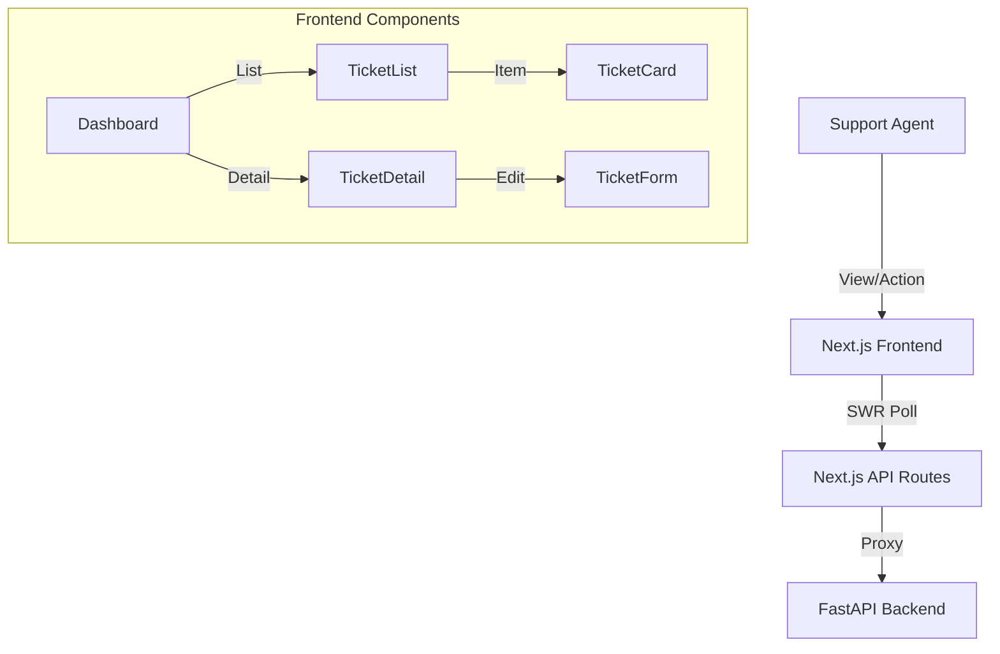

# 💻 Triage & Recovery Hub - Frontend

<div align="center">

[](./README.vi.md)

[](https://nextjs.org/)
[](https://react.dev/)
[](https://www.typescriptlang.org/)
[](https://tailwindcss.com/)
[](https://pnpm.io/)


**Premium Agent Dashboard for AI Triage System**
_Real-time Monitoring - Instant Responses - Modern UX_

[Backend Repo](https://github.com/MangBao/triage-recovery-hub-be) | [Live Demo](http://localhost:3000) | Report Bug (TODO)

</div>

---

## 🌟 Introduction

**Triage & Recovery Hub Frontend** is a modern, premium dashboard designed for support agents. Built with **Next.js 15** and **React 19**, it features a stunning glassmorphism UI/UX that allows agents to monitor tickets in real-time, review AI-generated drafts, and manage customer support workflows efficiently.

### ✨ Key Features

| Feature                   | Description                                               | Tech                      |
| :------------------------ | :-------------------------------------------------------- | :------------------------ |
| 🎨 **Premium UI/UX**      | Dark theme, glassmorphism, micro-animations, & responsive | `Tailwind CSS`            |
| ⚡ **Real-time Updates**  | Auto-polling ticket status & AI analysis progress         | `SWR` + `Polling Hooks`   |
| 🧠 **AI Integration**     | Display sentiment analysis, urgency scores, and AI drafts | `Next.js App Router`      |
| 🔍 **Advanced Filtering** | Filter by Status, Urgency, Category with premium UI       | `Framer Motion` (planned) |
| 📱 **Responsive Design**  | Fully optimized for Desktop, Tablet, and Mobile           | `Tailwind Responsive`     |

---

## 🏗️ Architecture



### 💡 Engineering Decisions

- **Next.js 15 App Router**: Leveraging Server Components for initial data load and Client Components for interactivity.
- **SWR for State Management**: Used for data fetching, caching, and auto-revalidation to keep the dashboard constantly updated without complex state managers.
- **Tailwind CSS + CSS Variables**: "PRO MAX" design system using strict CSS variables for theming, enabling easy switching and consistent design tokens.
- **Glassmorphism**: Custom utility classes (`.glass`, `.glass-card`) implemented in `globals.css` for a unified premium look.

---

## 🚀 Quick Start

### 1️⃣ Prerequisites

- **Node.js 18+**
- **pnpm** (Recommended) or npm/yarn
- **Backend Service** running on port 8000

### 2️⃣ Setup

```bash
# Clone project
git clone https://github.com/MangBao/triage-recovery-hub-fe.git
cd triage-recovery-hub-fe

# Install dependencies
pnpm install
```

### 3️⃣ Configure Environment

Create a `.env.local` file in the root directory:

```bash
NEXT_PUBLIC_API_BASE_URL=http://localhost:8000/api
```

### 4️⃣ Run Development Server

```bash
pnpm dev
```

Open [http://localhost:3000](http://localhost:3000) with your browser to see the result.

---

## 🧪 Verification & Build

### Linting

Check code quality and standard compliance:

```bash
pnpm lint
```

### Production Build

Build the application for production deployment:

```bash
pnpm build
pnpm start
```

---

## 🛠️ Tech Stack Details

| Component         | Tech                                                                                          | Version  |
| :---------------- | :-------------------------------------------------------------------------------------------- | :------- |
| **Framework**     |           | `15.1`   |
| **UI Library**    |                 | `19.0`   |
| **Styling**       |    | `3.4`    |
| **Languages**     |  | `5.0+`   |
| **Data Fetching** |                    | `2.0+`   |
| **Icons**         |              | `Latest` |

---

## 🤝 Contributing

1. Fork the project
2. Create your feature branch (`git checkout -b feature/AmazingFeature`)
3. Commit your changes (`git commit -m 'Add some AmazingFeature'`)
4. Push to the branch (`git push origin feature/AmazingFeature`)
5. Open a Pull Request

---

<div align="center">
  <p>Made with ❤️ by <a href="https://github.com/MangBao"><b>MangBao</b></a></p>
</div>
