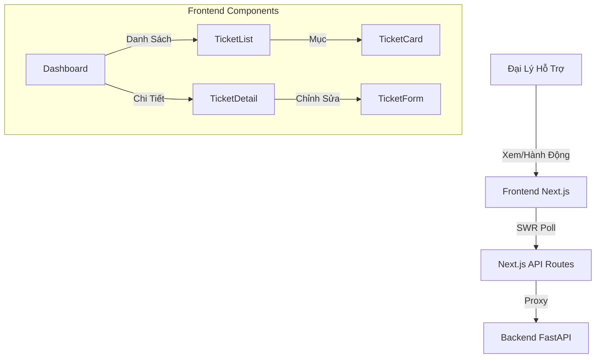

# 💻 Triage & Recovery Hub - Frontend

<div align="center">

[](./README.md)

[](https://nextjs.org/)
[](https://react.dev/)
[](https://www.typescriptlang.org/)
[](https://tailwindcss.com/)
[](https://pnpm.io/)


**Bảng Điều Khiển Đại Lý Cao Cấp cho Hệ Thống Phân Loại AI**
_Giám Sát Thời Gian Thực - Phản Hồi Tức Thì - UX Hiện Đại_

[Backend Repo](https://github.com/MangBao/triage-recovery-hub-be) | [Demo Trực Tiếp](http://localhost:3000) | Báo Lỗi (TODO)

</div>

---

## 🌟 Giới Thiệu

**Triage & Recovery Hub Frontend** là một bảng điều khiển hiện đại, cao cấp được thiết kế cho các đại lý hỗ trợ. Được xây dựng với **Next.js 15** và **React 19**, nó có tính năng giao diện người dùng UI/UX hiệu ứng kính tuyệt đẹp cho phép các đại lý theo dõi vé trong thời gian thực, xem xét các bản nháp do AI tạo ra và quản lý quy trình làm việc hỗ trợ khách hàng một cách hiệu quả.

### ✨ Tính Năng Chính

| Tính Năng                      | Mô Tả                                                              | Công Nghệ                 |
| :----------------------------- | :----------------------------------------------------------------- | :------------------------ |
| 🎨 **UI/UX Cao Cấp**           | Giao diện tối, hiệu ứng kính, hoạt ảnh vi mô & thích ứng           | `Tailwind CSS`            |
| ⚡ **Cập Nhật Thời Gian Thực** | Tự động cập nhật trạng thái vé & tiến trình phân tích AI           | `SWR` + `Polling Hooks`   |
| 🧠 **Tích Hợp AI**             | Hiển thị phân tích cảm xúc, điểm khẩn cấp và bản nháp AI           | `Next.js App Router`      |
| 🔍 **Bộ Lọc Nâng Cao**         | Lọc theo Trạng Thái, Mức Độ Khẩn Cấp, Danh Mục với UI cao cấp      | `Framer Motion` (dự kiến) |
| 📱 **Thiết Kế Thích Ứng**      | Tối ưu hóa hoàn toàn cho Máy Tính Để Bàn, Máy Tính Bảng và Di Động | `Tailwind Responsive`     |

---

## 🏗️ Kiến Trúc



### 💡 Quyết Định Kỹ Thuật

- **Next.js 15 App Router**: Tận dụng Server Components để tải dữ liệu ban đầu và Client Components cho tính tương tác.
- **SWR để Quản Lý Trạng Thái**: Được sử dụng để lấy dữ liệu, lưu vào bộ nhớ đệm và tự động xác thực lại để giữ bảng điều khiển được cập nhật liên tục mà không cần các trình quản lý trạng thái phức tạp.
- **Tailwind CSS + CSS Variables**: Hệ thống thiết kế "PRO MAX" sử dụng các biến CSS nghiêm ngặt cho chủ đề, cho phép chuyển đổi dễ dàng và các mã thông báo thiết kế nhất quán.
- **Glassmorphism**: Các lớp tiện ích tùy chỉnh (`.glass`, `.glass-card`) được triển khai trong `globals.css` cho một giao diện cao cấp thống nhất.

---

## 🚀 Bắt Đầu Nhanh

### 1️⃣ Điều Kiện Tiên Quyết

- **Node.js 18+**
- **pnpm** (Khuyến nghị) hoặc npm/yarn
- **Dịch Vụ Backend** đang chạy trên cổng 8000

### 2️⃣ Cài Đặt

```bash
# Clone dự án
git clone https://github.com/MangBao/triage-recovery-hub-fe.git
cd triage-recovery-hub-fe

# Cài đặt các gói phụ thuộc
pnpm install
```

### 3️⃣ Cấu Hình Môi Trường

Tạo tệp `.env.local` trong thư mục gốc:

```bash
NEXT_PUBLIC_API_BASE_URL=http://localhost:8000/api
```

### 4️⃣ Chạy Máy Chủ Phát Triển

```bash
pnpm dev
```

Mở [http://localhost:3000](http://localhost:3000) bằng trình duyệt của bạn để xem kết quả.

---

## 🧪 Xác Minh & Xây Dựng

### Linting

Kiểm tra chất lượng mã và tuân thủ tiêu chuẩn:

```bash
pnpm lint
```

### Xây Dựng Sản Phẩm

Xây dựng ứng dụng để triển khai sản phẩm:

```bash
pnpm build
pnpm start
```

---

## 🛠️ Chi Tiết Tech Stack

| Thành Phần      | Công Nghệ                                                                                     | Phiên Bản  |
| :-------------- | :-------------------------------------------------------------------------------------------- | :--------- |
| **Framework**   |           | `15.1`     |
| **Thư Viện UI** |                 | `19.0`     |
| **Styling**     |    | `3.4`      |
| **Ngôn Ngữ**    |  | `5.0+`     |
| **Lấy Dữ Liệu** |                    | `2.0+`     |
| **Biểu Tượng**  |              | `Mới Nhất` |

---

## 🤝 Đóng Góp

1. Fork dự án
2. Tạo nhánh tính năng của bạn (`git checkout -b feature/TinhNangTuyetVoi`)
3. Commit các thay đổi của bạn (`git commit -m 'Thêm TinhNangTuyetVoi'`)
4. Push lên nhánh (`git push origin feature/TinhNangTuyetVoi`)
5. Mở một Pull Request

---

<div align="center">
  <p>Được tạo với ❤️ bởi <a href="https://github.com/MangBao"><b>MangBao</b></a></p>
</div>
